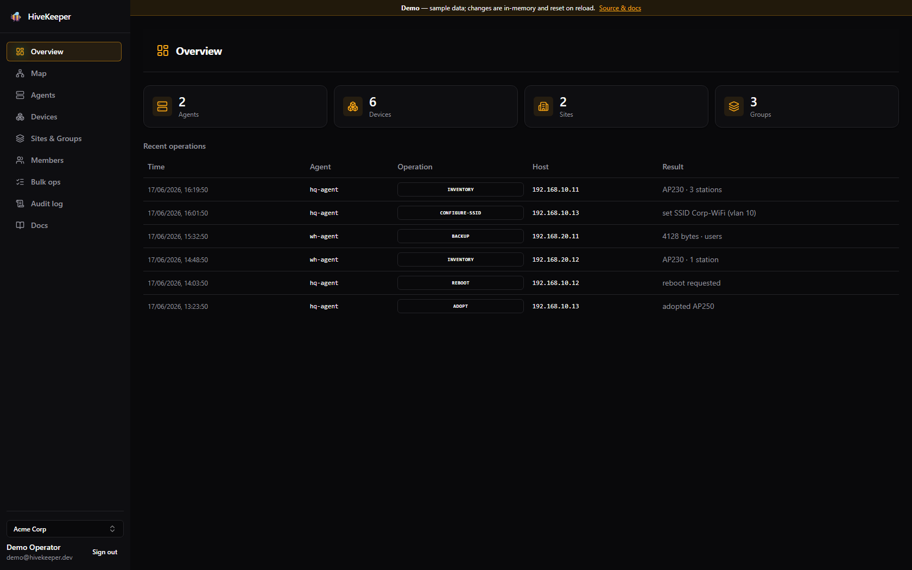
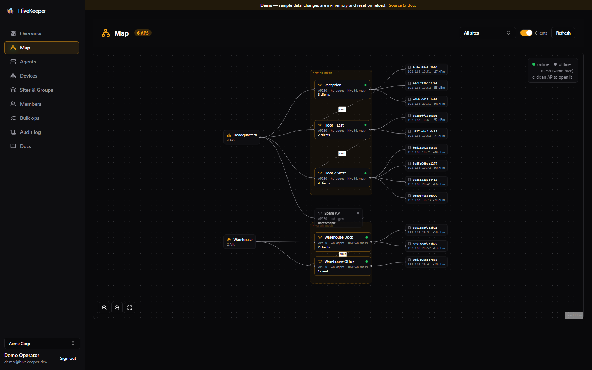
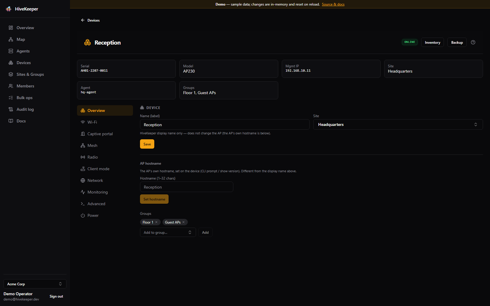

# HiveKeeper

Open-source tooling to manage **Aerohive / Extreme Networks HiveOS (IQ Engine)** access points
— AP230 / AP250 / AP630 (AP410 later) — **standalone over SSH, with no vendor cloud**
(no HiveManager / ExtremeCloud IQ, no license required).

These access points run their full control plane on-device and are fully manageable via the SSH CLI:
inventory, config backup/restore, firmware, SSID/VLAN, and Hive/mesh — all without phoning home.
HiveKeeper turns that CLI into a clean, scriptable, eventually-GUI tool.

> Status: **early development (v0.1)**. The first milestone is a CLI that inventories and
> git-backs-up a single AP over SSH, validated against a live AP230.



> **[▶ Try the live demo](https://me.gf2.in/HiveKeeper/demo/)** — the full console with sample data, no backend or hardware needed.

| The infrastructure map | A device's config page |
| :---: | :---: |
| [](docs/screenshots/map.png) | [](docs/screenshots/device-detail.png) |

## Why

Aerohive's legacy cloud/developer API is being retired and these (now end-of-life) APs are cheap and
plentiful second-hand — but the only official management path is cloud. Prior art is thin (an archived
netmiko wrapper, an unfinished Ansible collection; no netmiko/NAPALM driver). HiveKeeper fills that gap
for homelabbers and small shops who run these APs locally.

## What it can do today

Everything below is wired up and exercised by tests against HiveOS (IQ Engine). The CLI covers the core
engine commands; the web UI adds a richer config surface by generating HiveOS CLI and pushing it through the
agent (the same `apply-config` path the **Advanced** escape hatch exposes raw).

**Monitor / read**
- **Inventory** — model, serial, firmware, uptime, management IP, hive/mesh name, and the radio list.
- **Connected clients** — per-station MAC, IP, hostname, SSID, RSSI, OS type.
- **Live status** — per-radio channel / width / Tx power (`show acsp`), whether the AP is standalone or still
  phoning home to the cloud (`show capwap client`), and the recent on-AP log (`show log buffered`).
- **Infrastructure map** — a visual sites → APs → clients topology with live online/offline status.
- **Audit log** — an org-scoped record of operations (who did what, when).

**Configure / write** (per device, via the web UI)
- **Wi-Fi** — create / edit / remove WPA2-PSK SSIDs, with optional VLAN.
- **Captive portal**, **Mesh/Hive** join, **Radio** (band, channel, width, Tx power), **Client mode**,
  **Network** (IP / routing / DHCP / DNS), **Monitoring** (SNMP, syslog), **Power & LED**, **Reboot**.
- **Advanced** — a raw HiveOS CLI escape hatch (send arbitrary commands, optionally `save config`).
- **Backup** — capture the running-config to a git-versioned store, with optional secrets and PPSK users.
- **Restore** — re-apply a saved running-config (additive replay, then `save config`); CLI `restore` and, in
  the web UI, **Power → Maintenance**.
- **Firmware upgrade** — pull an image from a URL the AP can reach and reboot to activate it (`save image`).
  ⚠️ **Lab / untested in v0.1** — validate against real hardware first.

**Fleet & multi-org** (the gateway)
- **Discover** APs on a subnet (SSH banner sweep), then **adopt** them into a managed fleet.
- Organize devices into **sites** and **groups**; run **bulk** inventory/backup across org/site/group scopes.
- **Members & roles** (viewer / operator / admin / owner) and **agent enrollment** — under the OIDC profile.
- Durable, persisted **jobs** under the `postgres` profile.

**Not yet:** alerting / thresholds, config templates, scheduling, and any non-HiveOS vendor (the driver SPI
is ready for them). Firmware upgrade ships but is **lab/untested** until validated on real hardware.

## Architecture (one codebase, three deployment modes)

- **(A) Local** — `hive-cli` / desktop runs the engine in-process and SSHes the APs directly.
- **(B) Self-hosted server** — `hive-server` (Spring Boot) + `hive-web` (React) on `127.0.0.1`.
- **(C) Cloud + on-prem agent** — a multi-tenant control plane (`hive-gateway`) dispatches *intent*; an
  on-prem `hive-agent` runs the **same engine** and holds the SSH reach. Device credentials never leave the
  LAN. *Runs locally today (see [Running the stack](#running-the-stack)); hosted multi-tenant cloud is the north star.*

The load-bearing invariant: **`hive-core` is tenant-unaware, stateless, and transport-agnostic.**
CLI, server, and agent all invoke it through the same serializable `Command` / `Result` / `Event`
contract (`Engine.execute(Command) -> Publisher<Event>`). Local vs remote is wiring, not a fork.

### Modules

| Module | What |
| --- | --- |
| `hive-core` | Framework-free engine: `api` (Engine + DTOs), `engine` (LocalEngine), `transport` (sshj), `session` (CLI scraping), `model`, `drivers` (SPI), `spi` (EventSink/CredentialProvider/BackupStore), `tasks`. No Spring/UI/Jackson. |
| `hive-wire` | JSON (de)serialization of the core DTOs. The only module that depends on Jackson. |
| `hive-protocol` | The serializable gateway↔agent protocol; carries the core `Command` / `Result` / `Event` DTOs verbatim so local and remote are the same contract. |
| `hive-cli` | picocli front-end: `inventory`, `backup`. Talks to `Engine` + DTOs only. |
| `hive-server` | Spring Boot REST server (**mode B**): runs the engine in-process and SSHes APs directly. Localhost `:8080`. |
| `hive-agent` | On-prem agent (**mode C**): dials out to the gateway over WebSocket, runs the **same engine**, and holds the SSH reach to the LAN. Device credentials never leave it. |
| `hive-gateway` | Multi-tenant control plane (**mode C**): dispatches *intent* to enrolled agents, REST API on `:8090`. Optional `postgres` (RLS) and `oidc` profiles — see [Authentication](#authentication-the-gateway-runs-fine-without-keycloak). |
| `hive-web` | The web UI (Vite + React). **Not** a Gradle module — a standalone pnpm project under `hive-web/`. Direct mode → `hive-server`, gateway mode → `hive-gateway`. |

## Building

Requires a **JDK 21** (the project compiles/tests on Java 21). The Gradle wrapper is committed.

```sh
./gradlew build           # compile + test all modules
./gradlew :hive-cli:run --args="inventory 192.168.x.x"
```

The Gradle daemon may run on a newer JDK; the project pins a **Java 21 toolchain**. Local JDK locations
are configured in `gradle.properties` (`org.gradle.java.installations.paths`) — adjust those to your
machine, or add the [foojay-resolver](https://github.com/gradle/foojay-toolchains) plugin to
auto-provision a JDK 21.

## Running the stack

The web UI (`hive-web`) needs **Node + pnpm**. Two scripts bring up everything and open the browser at
**http://localhost:5173** (use `localhost`, not `127.0.0.1` — Vite binds IPv6); press Enter in the window
to stop:

```powershell
# Solo: single user, single AP, no sign-in, no DB. The simplest way to manage one AP locally.
powershell -ExecutionPolicy Bypass -File scripts/run-solo.ps1

# Full local dev: hive-server (:8080) + hive-gateway (:8090, demo tenants) + an agent + the UI.
powershell -ExecutionPolicy Bypass -File scripts/run-local.ps1
```

Both default the AP's SSH login to the public Aerohive defaults (`admin` / `aerohive`); override with
`HIVEKEEPER_DEFAULT_USER` / `HIVEKEEPER_DEFAULT_PASSWORD` before running. To run pieces by hand, each JVM
service is an `application`-plugin module (`./gradlew :hive-gateway:run`, `:hive-server:run`, etc.) and the
UI is `cd hive-web && pnpm install && pnpm dev`. See [`hive-web/README.md`](hive-web/README.md) for the UI
modes.

### As containers (Docker / Podman Compose)

To run it as a deployed stack instead of the dev scripts, the repo root ships layered Compose files —
gateway + agent by default, with `docker-compose.postgres.yml` (persistence) and `docker-compose.keycloak.yml`
(OIDC) overrides:

```sh
docker compose up -d --build                 # gateway (in-memory) + agent
# + persistence:  docker compose -f docker-compose.yml -f docker-compose.postgres.yml up -d --build
```

Released images live at `ghcr.io/ggfto/hivekeeper-{gateway,agent,server}`. See
[`docs/deployment.md`](docs/deployment.md) for the full matrix, env vars, and how releases are versioned
(semantic-release → GHCR images).

## Authentication (the gateway runs fine without Keycloak)

The `hive-gateway` control plane supports user login via OpenID Connect (Keycloak in dev), but **OIDC is
entirely optional** — it is gated behind the Spring `oidc` profile. Leave that profile off and there is no
Keycloak dependency anywhere: `OidcSecurityConfig`, the first-run `SetupService`, and `KeycloakAdminClient`
are all `@Profile("oidc")`, so without it `DefaultSecurityConfig` takes over (`permitAll`, with the
controllers enforcing the `X-Tenant-Key` service principal). Pick the mode that fits:

| Mode | How to start | Sign-in | Auth model |
| --- | --- | --- | --- |
| **Solo** (single user, single AP, local) | `HIVEKEEPER_SOLO=true` (no `oidc` profile) | None | Every request is the local owner |
| **Tenant-key** (multi-org, dev/demo) | `SPRING_PROFILES_ACTIVE=demo` | Web "dev mode" toggle | Static `X-Tenant-Key` per tenant |
| **OIDC** (per-user roles) | `SPRING_PROFILES_ACTIVE=postgres,oidc` + Keycloak | OIDC login | JWT identity + DB-backed org/site/group roles |

### Solo mode — the simplest way to run without Keycloak

```powershell
powershell -ExecutionPolicy Bypass -File scripts/run-solo.ps1   # full stack
# or just the gateway:  HIVEKEEPER_SOLO=true ./gradlew :hive-gateway:run
```

No login screen, no organizations — the gateway authorizes every request as the owner of an implicit
`local` tenant, and the web app learns this at boot from `/api/mode` and skips the sign-in gate entirely.
Best for a single local AP (the v0.1 scope: inventory + git backup).

> ⚠️ Solo mode disables authentication. Run it only on a trusted machine and keep the gateway bound to
> `localhost` (the default in `application.properties`).

### Tenant-key mode — the multi-org console without an IdP

```powershell
powershell -ExecutionPolicy Bypass -File scripts/run-local.ps1   # full stack
# or just the gateway:  SPRING_PROFILES_ACTIVE=demo ./gradlew :hive-gateway:run
```

The `demo` profile seeds well-known tenants (`acme` / `globex`) with keys `acme-key` / `globex-key`. In the
web UI, enable **dev mode** so the console sends `X-Tenant-Key` instead of a bearer token. This is
local-dev convenience only — the keys are public and in source, so **never enable `demo` in production**.

### What you give up without OIDC

Per-user login, the first-run setup wizard (`SetupService` is OIDC-only), and per-user authorization by
scoped role — all of which depend on an IdP authenticating human identities. For a full deployment, enable
OIDC: `scripts/dev-keycloak.ps1` brings up a dev Keycloak + realm, then run with
`SPRING_PROFILES_ACTIVE=postgres,oidc`. In that setup you can also set `HIVEKEEPER_TENANTKEY_ENABLED=false`
so a leaked static key cannot bypass per-user authorization.

## Documentation

The canonical docs live in [`docs/`](docs) as plain markdown, and are rendered in two places from that
**single source**:

- **Public docs site** — Astro + Starlight under [`website/`](website) (`cd website && pnpm install && pnpm dev`).
- **In-app Help** — the `hive-web` console bundles the same markdown (a **Docs** section in the sidebar), so
  solo / self-hosted deployments have the manual offline. `hive-web/scripts/sync-docs.mjs` copies `docs/` in
  at build time; device pages also surface contextual help inline.

To add or edit a page, change the markdown in `docs/` — both surfaces pick it up. See
[`website/README.md`](website/README.md) for the site workflow.

## Roadmap

The full, phased plan — every item's HiveOS CLI grammar confirmed live on an AP230 — lives in
[`docs/roadmap.md`](docs/roadmap.md). In short:

- **Phase 0 — Foundation** ✅ **shipped** — credential management (set/rotate a device's SSH credential from the
  UI, **sealed to the agent's public key** so it is **never stored in the cloud**, written to the agent's vault
  encrypted at rest) and trustworthy adoption (identify HiveOS APs during discovery, flag tested vs untested
  models, supply a credential at adopt time). Changing the admin password *on the AP* is built behind a driver
  seam, disabled until its HiveOS grammar is confirmed live.
- **Phase 1 — Radio completeness** — channel width, client Tx-power control, band-steering, client
  load-balancing, and slow-rate pruning, making the built-in radio best-practice advisories actionable.
- **Phase 2 — Wi-Fi & security** — WPA3-SAE, 802.1X / RADIUS, PPSK, and per-SSID hardening (schedules, client
  isolation, 802.11k/v).
- **Phase 3 — Network policy** — user-profiles, VLAN / QoS / rate-limit / firewall, IGMP snooping, LLDP.
- **Phase 4 — RF tuning** — DFS, short guard interval, A-MPDU / A-MSDU, beamforming, high-density knobs.
- **Phase 5 — Operations** — firmware-upgrade GA, scheduling, alerting / thresholds, config templates.

Cross-cutting, not phase-bound (see [`docs/agent-protocol.md`](docs/agent-protocol.md) for the mode-C transport
details):

- **Production security** — SSH host-key verification (today `ACCEPT_ALL`; switch to known-hosts / TOFU before
  any non-lab use), automated agent enrollment (one-time token → CSR → issued/auto-renewed cert, vs today's
  pre-provisioned dev certs), end-to-end secret encryption to the agent's public key, per-user authorization
  on every endpoint, and TLS / ingress hardening.
- **Multi-vendor** — the driver SPI is ready, but only `HiveOsDriver` exists today (e.g. AP410 / WiNG later).
- **North star** — a hosted, multi-tenant cloud control plane (mode C runs locally today).

Already shipped since the early notes (so older docs may lag): OIDC operator auth, Postgres + Row-Level
Security, durable jobs with redelivery, SSE progress through the gateway, the fleet/sites/groups model,
config **restore** via the CLI / API / UI, and a (lab/untested) firmware-upgrade path.

## License

[Apache License 2.0](LICENSE).
