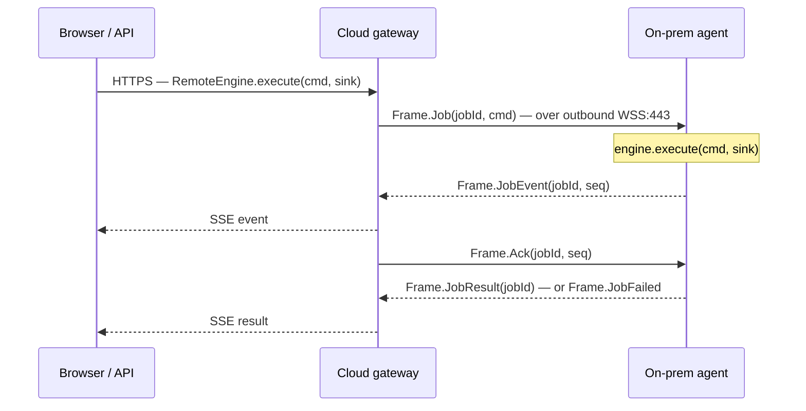

Status: **built & proven live**. The `hive-protocol` reference channel, the WebSocket transport, and the
`hive-agent` / `hive-gateway` deployables are all implemented — the full chain runs cloud → agent → AP230.
See [Implemented](#implemented) for what landed and [Not yet implemented](#not-yet-implemented) for the gaps.

## Why it looks like this

The on-prem agent lives on a private LAN behind NAT/firewall and holds the SSH reach to the APs. The
cloud cannot connect inward, so the **agent dials out** and the cloud only ever *responds* on that
connection. The wire payload is the **already-serializable in-process API** (`Command` / `Event` /
`Result`, serialized by `hive-wire`), so the agent literally does `engine.execute(decode(frame))`.

`RemoteEngine` implements the same `Engine` interface as `LocalEngine`; the caller cannot tell whether
work runs in-process or on an agent 1000 km away. (`LoopbackProtocolTest` proves this with an in-memory
channel — no socket.)

## Frames (`io.hivekeeper.protocol.Frame`)

| Frame | Direction | Purpose |
| --- | --- | --- |
| `Hello(agentId, protocolVersion)` | agent → gw | identify + version handshake on connect |
| `Resume(agentId, lastJobId, lastSeq)` | agent → gw | after reconnect, request redelivery |
| `Job(jobId, idempotencyKey, deadlineEpochMs, command)` | gw → agent | a unit of work |
| `JobEvent(jobId, seq, event)` | agent → gw | streamed progress; `seq` monotonic per job |
| `JobResult(jobId, result)` | agent → gw | terminal success |
| `JobFailed(jobId, error, detail)` | agent → gw | terminal failure |
| `Ack(jobId, ackedSeq)` | gw → agent | confirms receipt up to `seq` |
| `Heartbeat(epochMillis)` | both | liveness |

## Transport & resilience (implemented in `hive-agent` / `hive-gateway`)

- **One persistent outbound WebSocket over TLS:443**, multiplexed by `jobId`. No inbound ports, proxy-friendly.
- **Heartbeat** ~20–30s each way; miss N in a row ⇒ reconnect.
- **Reconnect** with exponential backoff + jitter. On reconnect the agent sends `Resume`; the gateway
  redelivers un-acked work from its job DB.
- **Idempotency**: `Job.idempotencyKey` lets the agent dedupe a redelivered job; `JobEvent.seq` + `Ack`
  give at-least-once streaming with gap/dup detection.
- **Offline buffering** lives in the control-plane DB (per-agent, TTL'd, idempotency-keyed) — **not** a
  broker.

## Security

- Device credentials **stay on-prem**: the agent resolves them via a local `CredentialProvider`; the
  cloud stores only device refs + intent + metadata.
- Enrollment: one-time token (scoped `tenantId`/`siteId`) → agent generates a keypair **locally** →
  mTLS client cert (CA-pinned, short-lived, auto-renewed). `tenantId` is derived server-side from the
  agent record, never trusted from the client.

## Implemented

- **`hive-agent`** — `WebSocketFrameChannel` (Java-WebSocket, auto-reconnect) wrapping `AgentRuntime`;
  service + container packaging.
- **`hive-gateway`** — Spring WebSocket server wrapping `RemoteEngine`, tenant-scoped REST.
- **mTLS** — the agent presents a client certificate; the gateway derives the agent identity from the
  cert CN and the tenant from the enrollment record (server-side, never from `Hello`). A bearer
  enrollment token is the fallback/bootstrap. Dev PKI: `scripts/gen-dev-pki.ps1`; gateway TLS via the
  `mtls` Spring profile (`application-mtls.properties`, `client-auth=want`).
- **Multi-tenancy** — `(tenantId, agentId)`-keyed registry; REST scoped by `X-Tenant-Key`; cross-tenant
  lookups 404 with no existence leakage.
- **Postgres + RLS** — the `postgres` profile backs tenants/enrollments/fleet/jobs with PostgreSQL (Flyway);
  the app connects as a restricted role (NOSUPERUSER, NOBYPASSRLS) so Row-Level Security on tenant-scoped
  tables is enforced by the DB, not the app. The default no-DB mode still works (in-memory stores).
- **Durable jobs + redelivery** — a `job` table (RLS) persists work; `JobGateway` dispatches if connected
  and **redelivers non-terminal jobs on agent reconnect** (`Resume`); the agent caches recent terminal
  results by idempotency key for at-least-once-but-idempotent execution. Endpoints: `POST
  /api/agents/{id}/jobs`, `GET /api/jobs/{id}`.
- **SSE through the gateway** — `POST /api/agents/{id}/inventory/stream` forwards the agent's progress events
  to the browser, so gateway mode shows live progress like direct mode.
- **OIDC operator auth** — under the `oidc` profile the gateway validates user JWTs (Keycloak in dev) and
  authorizes via DB-backed org/site/group roles; the `X-Tenant-Key` service principal remains for automation.

Proven live end-to-end: HTTPS/OIDC (operator) → mTLS WebSocket (agent, cert identity) → SSH (agent → AP230),
including submit-while-agent-offline → reconnect → redelivered → succeeded.

## Not yet implemented

- **Automated certificate enrollment** — the one-time token exists (`POST /api/enrollments`), but the
  token → CSR → issued/auto-renewed cert flow is not built; mTLS certs are still pre-provisioned via
  `scripts/gen-dev-pki.ps1`.
- **End-to-end secret encryption to the agent's public key** — secrets are encrypted at rest by the gateway
  today; encrypting them target-agent-side is a planned hardening (see `SecretCipher`).
- **Per-user authorization on every endpoint** — the bearer filter runs on `/api/me`; extending per-user
  enforcement (vs the controller-level checks) across the rest of the API is the next phase.
- **TLS / ingress hardening** for a real cloud deployment (the WSS:443 single-port story is by design;
  productionizing the edge is not done).
