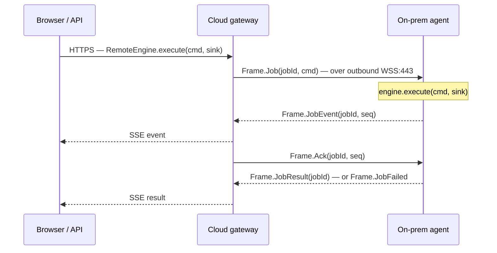

Status: **built & proven live**. The `hive-protocol` reference channel, the WebSocket transport, and the
`hive-agent` / `hive-gateway` deployables are all implemented — the full chain runs cloud → agent → AP230.
See [Implemented](#implemented) for what landed and [Not yet implemented](#not-yet-implemented) for the gaps.

## Why it looks like this

The on-prem agent lives on a private LAN behind NAT/firewall and holds the SSH reach to the APs. The
cloud cannot connect inward, so the **agent dials out** and the cloud only ever *responds* on that
connection. The wire payload is the **already-serializable in-process API** (`Command` / `Event` /
`Result`, serialized by `hive-wire`), so the agent literally does `engine.execute(decode(frame))`.

```mermaid
sequenceDiagram
    participant B as Browser / API
    participant G as Cloud gateway
    participant A as On-prem agent
    B->>G: HTTPS — RemoteEngine.execute(cmd, sink)
    G->>A: Frame.Job(jobId, cmd) — over outbound WSS:443
    Note over A: engine.execute(cmd, sink)
    A-->>G: Frame.JobEvent(jobId, seq)
    G-->>B: SSE event
    G->>A: Frame.Ack(jobId, seq)
    A-->>G: Frame.JobResult(jobId) — or Frame.JobFailed
    G-->>B: SSE result
```

`RemoteEngine` implements the same `Engine` interface as `LocalEngine`; the caller cannot tell whether
work runs in-process or on an agent 1000 km away. (`LoopbackProtocolTest` proves this with an in-memory
channel — no socket.)

## Frames (`io.hivekeeper.protocol.Frame`)

| Frame | Direction | Purpose |
| --- | --- | --- |
| `Hello(agentId, protocolVersion)` | agent → gw | identify + version handshake on connect |
| `Resume(agentId, lastJobId, lastSeq)` | agent → gw | after reconnect, request redelivery |
| `Job(jobId, idempotencyKey, deadlineEpochMs, command)` | gw → agent | a unit of work |
| `JobEvent(jobId, seq, event)` | agent → gw | streamed progress; `seq` monotonic per job |
| `JobResult(jobId, result)` | agent → gw | terminal success |
| `JobFailed(jobId, error, detail)` | agent → gw | terminal failure |
| `Ack(jobId, ackedSeq)` | gw → agent | confirms receipt up to `seq` |
| `Heartbeat(epochMillis)` | both | liveness |

## Transport & resilience (implemented in `hive-agent` / `hive-gateway`)

- **One persistent outbound WebSocket over TLS:443**, multiplexed by `jobId`. No inbound ports, proxy-friendly.
- **Heartbeat** ~20–30s each way; miss N in a row ⇒ reconnect.
- **Reconnect** with exponential backoff + jitter. On reconnect the agent sends `Resume`; the gateway
  redelivers un-acked work from its job DB.
- **A reconnect outruns the old socket's close, and the registry expects it.** When the uplink dies abruptly —
  a tunnel or NAT dropping the stream, which the agent sees as a bare `1006` close with no close frame — the
  gateway is left holding a *half-open* socket that nothing closes until a write fails or an idle timeout
  fires. The agent is back in about a second on a new session, so the stale close lands **after** the live
  registration. `AgentRegistry` therefore tags each entry with the session that owns it and evicts only on a
  close from that session; `AgentWebSocketHandler` likewise treats a superseded close as a non-event rather
  than a disconnect. Without that, a straggling close deletes the entry the reconnect just installed and the
  agent goes on running while the gateway believes it is gone: missing from `GET /api/agents`, **offline** in
  the console, and `agent_not_connected` for every job — until its next reconnect, which may be hours away.
- **Idempotency**: `Job.idempotencyKey` lets the agent dedupe a redelivered job; `JobEvent.seq` + `Ack`
  give at-least-once streaming with gap/dup detection.
- **Graceful drain on shutdown**: the agent stops accepting new jobs and lets the running one finish and send
  its terminal frame before it exits (bounded by `shutdown.drain.seconds`), *then* closes the channel — so a
  restart (redeploy, reboot, auto-update) does not interrupt a job or make the gateway redeliver it.
- **Failover between site agents**: a durable job addressed to an agent that disconnects is atomically
  reassigned to its site's standby and redispatched (`JobService.reassign`, an `UPDATE … RETURNING` guarded by
  the addressed agent). The dedupe is per-process, so this is what keeps a mid-flight config from re-running on
  the replacement — see [Architecture](/architecture/) → *Redundant agents*.
- **New command types** ride the same `Frame.Job` envelope, no wire change (the codec derives subtypes from the
  sealed `Command` hierarchy): `ScanChannels` (read `show acsp` channel costs + neighbours) and the
  agent-scoped `ConfigureBackupDestination` (the git push target, its token sealed to the agent).
- **Offline buffering** lives in the control-plane DB (per-agent, TTL'd, idempotency-keyed) — **not** a
  broker.

## Security

- Device credentials **stay on-prem**: the agent resolves them via a local `CredentialProvider`; the
  cloud stores only device refs + intent + metadata.
- Managing a credential is **end-to-end encrypted to the agent**: on `POST /api/agents/{id}/set-credential`
  the gateway seals the secret to the agent's public key (taken from its mTLS cert) with `EnvelopeCipher`
  (RSA-OAEP + AES-GCM), dispatches a `SetCredential` command synchronously (**never** persisted as a durable
  job, never logged), and the agent unseals it with its keystore private key before writing its vault
  (encrypted at rest). The gateway holds no plaintext. **Minted PPSK keys take the same path**: a
  `ManagePpskUser` command carries the key sealed to the agent (`EnvelopeCipher`), the agent unseals it locally
  into its at-rest-encrypted PPSK store, and the cloud persists only a reference — never the usable key.
- Enrollment: one-time token (scoped `tenantId`/`siteId`) → agent generates a keypair **locally** →
  mTLS client cert (CA-pinned, short-lived, auto-renewed). `tenantId` is derived server-side from the
  agent record, never trusted from the client.

## Implemented

- **`hive-agent`** — `WebSocketFrameChannel` (Java-WebSocket, auto-reconnect) wrapping `AgentRuntime`;
  service + container packaging.
- **`hive-gateway`** — Spring WebSocket server wrapping `RemoteEngine`, tenant-scoped REST.
- **mTLS** — the agent presents a client certificate; the gateway derives the agent identity from the
  cert CN and the tenant from the enrollment record (server-side, never from `Hello`). A bearer
  enrollment token is the fallback/bootstrap. Dev PKI: `scripts/gen-dev-pki.ps1`; gateway TLS via the
  `mtls` Spring profile (`application-mtls.properties`, `client-auth=want`).
- **Automated certificate enrollment (slice 1)** — a fresh agent with no keystore exchanges its one-time
  token for a signed client cert: it generates a keypair locally, posts a PKCS#10 CSR to
  `POST /api/enrollments/{token}/certificate`, and the gateway's CA signs a leaf with **server-assigned**
  `CN = agentId` (the CSR subject is ignored), EKU `clientAuth`, 90-day validity. The token is consumed
  atomically (one cert per token). The agent writes the PKCS12 keystore + truststore and connects over mTLS.
  CA custody is a **file-backed** keystore (`HIVEKEEPER_CA_KEYSTORE`, dev/self-hosted only — reuse
  `dev-pki/ca.p12`) behind a `CertificateAuthority` interface, so a KMS/HSM intermediate CA can replace it
  later. Agent env: `HIVEKEEPER_ENROLLMENT_TOKEN` / `HIVEKEEPER_ENROLLMENT_URL` (+ `HIVEKEEPER_ENROLLMENT_CACERT`
  for an https bootstrap).
- **Install bundle + a self-known agent endpoint** — the console hands the operator a ready-to-run zip instead
  of a wall of values to transcribe: `POST /api/enrollments/bundle` packages an agent enrolled a moment ago as
  its compose, a `.env` filled in with the one-time token, the URLs and freshly generated secrets (vault key,
  keystore password), `ca.pem` and a README. It **packages rather than enrolls** — it takes the token the caller
  just received — so "add the agent, then download it" stays one flow instead of failing the second call with
  `agent_exists`. The compose and env template are copied out of `deploy/portainer/` at build time, so the
  bundle cannot drift from the deployment the docs describe.

  The hostname comes from `GET /api/enrollments/endpoint`, which reads the **dNSName SAN of the gateway's own
  server certificate**. The application never had `HIVEKEEPER_AGENT_DOMAIN` (only the PKI and tunnel init
  containers do), but it did not need it: an agent's handshake verifies the name it dialed against that SAN, so
  the SAN *is* the agent-facing hostname and any other value would fail closed. `hivekeeper.agent.domain`
  overrides it for a deployment whose public name is a CNAME; a gateway that can determine neither reports
  `host: null` and the console asks, as it did before.
- **Certificate auto-renewal & revocation (slice 2)** — the agent re-issues its cert before expiry and an
  operator can revoke/re-enroll an agent:
  - **Auto-renewal** — a background loop checks the leaf's expiry (`HIVEKEEPER_CERT_RENEW_WINDOW_DAYS`,
    default 30; checked every `HIVEKEEPER_CERT_RENEW_CHECK_HOURS`, default 12) and, once inside the window,
    posts a fresh CSR to `POST /api/enrollments/certificate/renew`. That endpoint is authenticated by the
    agent's **current mTLS cert** (no token — renewal is repeatable); identity is the cert CN, exactly like the
    handshake. Renewal **keeps the keypair** (it is not a rekey), so the gateway's cached public key — used to
    seal secrets to the agent — stays valid. The new keystore takes effect on the next reconnect.
  - **Revocation** — `POST /api/agents/{id}/revoke` (admin) marks the agent's enrollment revoked; the gateway
    then refuses both its handshake (403) and its renewals. The gateway is the sole relying party for these
    client certs, so it enforces revocation directly at the auth seam — no CRL/OCSP distribution is needed.
    `POST /api/agents/{id}/re-enroll` (admin) clears the revoked/consumed marks and mints a **fresh one-time
    token** so a replacement agent can bootstrap. Flyway `V12` adds `revoked_at` / `revoked_reason`.
  - **Deletion** — `DELETE /api/agents/{id}` (admin on the agent's scope) removes the agent outright: its
    durable `agent` identity, its `agent_enrollment` credential, and — by cascade — every `device_agent`
    reachability row it held. Unfinished jobs addressed to it are marked `FAILED` rather than left to be
    redelivered to whatever next claims the id (`job` is granted update, not delete). Flyway `V15` adds the
    missing `delete` grant on `agent_enrollment`.

    Delete is the **destructive** counterpart to revoke, and the two answer different questions. Revoke is
    reversible and *keeps* reachability, so re-enrolling restores the agent with no data loss — use it for a
    compromised or temporarily decommissioned agent. Delete frees the agent id for a clean re-install and
    cannot be undone: the devices survive, but they lose this agent from their reachable set, so an AP only
    this agent could drive is unmanageable until another agent is pointed at it. The console states that
    device count on the confirm button. A currently-connected agent is not forced off its socket — as with
    revoke, the handshake simply fails at its next reconnect, so stop the on-prem container as part of the
    re-install.
  - **Deferred to a later slice:** an intermediate CA and KMS/HSM custody of the CA key (slice 1's CA key is a
    file on the gateway — dev/self-hosted only).
- **Multi-tenancy** — `(tenantId, agentId)`-keyed registry; REST scoped by `X-Tenant-Key`; cross-tenant
  lookups 404 with no existence leakage.
- **Postgres + RLS** — the `postgres` profile backs tenants/enrollments/fleet/jobs with PostgreSQL (Flyway);
  the app connects as a restricted role (NOSUPERUSER, NOBYPASSRLS) so Row-Level Security on tenant-scoped
  tables is enforced by the DB, not the app. The default no-DB mode still works (in-memory stores).
- **Durable jobs + redelivery** — a `job` table (RLS) persists work; `JobGateway` dispatches if connected
  and **redelivers non-terminal jobs on agent reconnect** (`Resume`); the agent caches recent terminal
  results by idempotency key for at-least-once-but-idempotent execution. Endpoints: `POST
  /api/agents/{id}/jobs`, `GET /api/jobs/{id}`.
- **SSE through the gateway** — `POST /api/agents/{id}/inventory/stream` forwards the agent's progress events
  to the browser, so gateway mode shows live progress like direct mode.
- **OIDC operator auth** — under the `oidc` profile the gateway validates user JWTs (Keycloak in dev) and
  authorizes via DB-backed org/site/group roles; the `X-Tenant-Key` service principal remains for automation.

Proven live end-to-end: HTTPS/OIDC (operator) → mTLS WebSocket (agent, cert identity) → SSH (agent → AP230),
including submit-while-agent-offline → reconnect → redelivered → succeeded.

## Not yet implemented

- **Certificate intermediate CA & KMS/HSM custody (enrollment slice 3)** — slices 1–2 (bootstrap, auto-renewal,
  revocation) are built (see Implemented). What remains for production custody is an **intermediate CA** (root
  signs an intermediate; leaves chain root → intermediate → leaf) and moving the CA private key into a
  **KMS/HSM** behind the existing `CertificateAuthority` interface — slice 1's CA key is a file on the gateway
  (dev/self-hosted only). A formal signed **CRL/OCSP** would only be needed if something other than the gateway
  ever verifies these client certs.
- **End-to-end secret encryption to the agent's public key** — **done**. Credential management
  (`SetCredential`), minted PPSK keys (`ManagePpskUser`), and now **secret-bearing durable jobs** all seal to
  the agent's key with `EnvelopeCipher`: a `configure-ssid` / `configure-hive` job is wrapped in a
  `Command.Sealed` (the inner command's JSON sealed to the agent) before it is persisted, so the gateway can no
  longer read the SSID passphrase / hive password at rest — only the agent unwraps it (the symmetric
  `SecretCipher` at-rest layer remains underneath as defense-in-depth). Job *results* are still symmetric at
  rest and field-redacted on read.
- **Per-user authorization on every endpoint** — the bearer filter runs on `/api/me`; extending per-user
  enforcement (vs the controller-level checks) across the rest of the API is the next phase.
- **TLS / ingress hardening** for a real cloud deployment (the WSS:443 single-port story is by design;
  productionizing the edge is not done).
