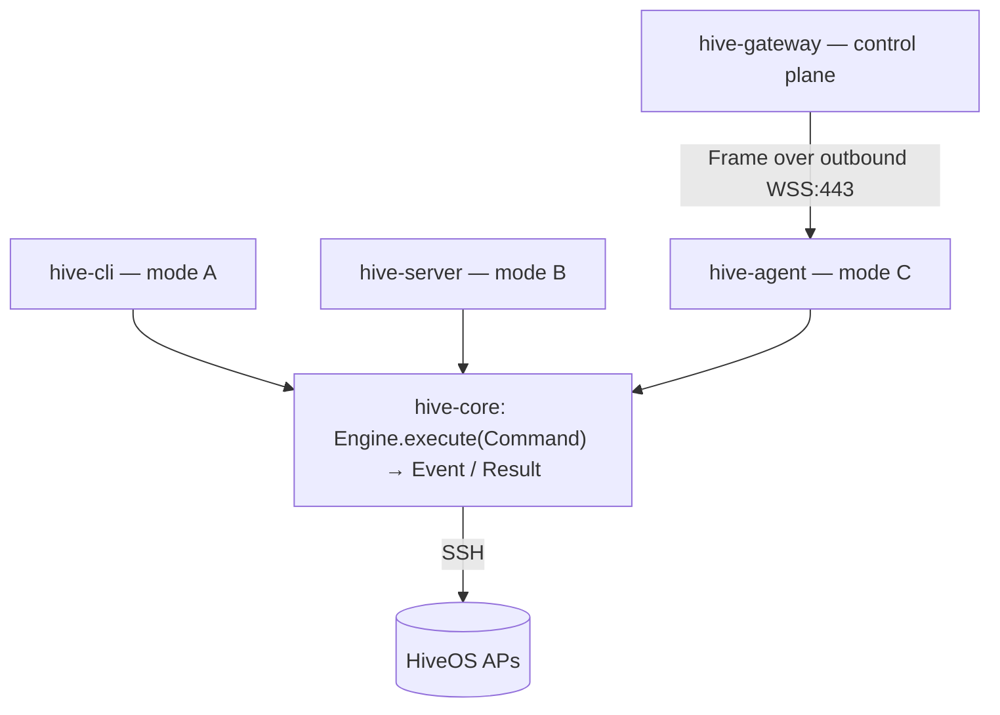

## Three deployment modes, one codebase

- **(A) Local** — `hive-cli` / desktop runs the engine in-process and SSHes the APs directly.
- **(B) Self-hosted server** — `hive-server` (Spring Boot) + `hive-web` (React) on `127.0.0.1`.
- **(C) Cloud + on-prem agent** — a multi-tenant control plane (`hive-gateway`) dispatches *intent*; an
  on-prem `hive-agent` runs the **same engine** and holds the SSH reach. Device credentials never leave the
  LAN. Runs locally today; a hosted multi-tenant cloud is the north star.

The load-bearing invariant: **`hive-core` is tenant-unaware, stateless, and transport-agnostic.**
CLI, server, and agent all invoke it through the same serializable `Command` / `Result` / `Event`
contract (`Engine.execute(Command) -> Publisher<Event>`). Local vs remote is wiring, not a fork.

## Modules

| Module | What |
| --- | --- |
| `hive-core` | Framework-free engine: `api` (Engine + DTOs), `engine` (LocalEngine), `transport` (sshj), `session` (CLI scraping), `model`, `drivers` (SPI), `spi` (EventSink/CredentialProvider/BackupStore), `tasks`. No Spring/UI/Jackson. |
| `hive-wire` | JSON (de)serialization of the core DTOs. The only module that depends on Jackson. |
| `hive-protocol` | The serializable gateway↔agent protocol; carries the core `Command` / `Result` / `Event` DTOs verbatim so local and remote are the same contract. |
| `hive-cli` | picocli front-end: `inventory`, `backup`, and the config commands. Talks to `Engine` + DTOs only. |
| `hive-server` | Spring Boot REST server (**mode B**): runs the engine in-process and SSHes APs directly. Localhost `:8080`. |
| `hive-agent` | On-prem agent (**mode C**): dials out to the gateway over WebSocket, runs the **same engine**, and holds the SSH reach to the LAN. Device credentials never leave it. |
| `hive-gateway` | Multi-tenant control plane (**mode C**): dispatches *intent* to enrolled agents, REST API on `:8090`. Optional `postgres` (RLS) and `oidc` profiles — see [Authentication](/authentication/). |
| `hive-web` | The web UI (Vite + React). **Not** a Gradle module — a standalone pnpm project. Direct mode → `hive-server`, gateway mode → `hive-gateway`. |

## How a request flows in mode C

The on-prem agent lives on a private LAN behind NAT/firewall and holds the SSH reach to the APs. The
cloud cannot connect inward, so the **agent dials out** and the cloud only ever *responds* on that
connection. The wire payload is the **already-serializable in-process API**, so the agent literally does
`engine.execute(decode(frame))`. The full transport, framing, and resilience design is documented in the
[agent ⇄ gateway protocol](/agent-protocol/).
