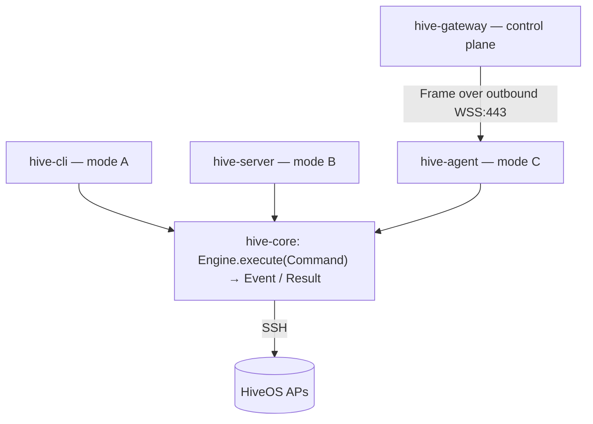

## Three deployment modes, one codebase

- **(A) Local** — `hive-cli` / desktop runs the engine in-process and SSHes the APs directly.
- **(B) Self-hosted server** — `hive-server` (Spring Boot) + `hive-web` (React) on `127.0.0.1`.
- **(C) Cloud + on-prem agent** — a multi-tenant control plane (`hive-gateway`) dispatches *intent*; an
  on-prem `hive-agent` runs the **same engine** and holds the SSH reach. Device credentials never leave the
  LAN. Runs locally today; a hosted multi-tenant cloud is the north star.

The load-bearing invariant: **`hive-core` is tenant-unaware, stateless, and transport-agnostic.**
CLI, server, and agent all invoke it through the same serializable `Command` / `Result` / `Event`
contract (`Engine.execute(Command) -> Publisher<Event>`). Local vs remote is wiring, not a fork.

## Modules

| Module | What |
| --- | --- |
| `hive-core` | Framework-free engine: `api` (Engine + DTOs), `engine` (LocalEngine), `transport` (sshj), `session` (CLI scraping), `model`, `drivers` (SPI), `spi` (EventSink / `CredentialProvider` + writable variant / `SecretUnsealer` / `PpskUserStore` / BackupStore), `crypto` (AES-GCM `SecretCipher` for at-rest, `EnvelopeCipher` for sealing a secret to an agent's public key, `PskGenerator`), `alerts` (the pure alert / radio-advisory rule engine, shared verbatim with the web), `tasks`. No Spring/UI/Jackson. |
| `hive-wire` | JSON (de)serialization of the core DTOs. The only module that depends on Jackson. |
| `hive-protocol` | The serializable gateway↔agent protocol; carries the core `Command` / `Result` / `Event` DTOs verbatim so local and remote are the same contract. |
| `hive-cli` | picocli front-end: `inventory`, `backup`, and the config commands. Talks to `Engine` + DTOs only. |
| `hive-server` | Spring Boot REST server (**mode B**): runs the engine in-process and SSHes APs directly. Localhost `:8080`. |
| `hive-agent` | On-prem agent (**mode C**): dials out to the gateway over WebSocket, runs the **same engine**, and holds the SSH reach to the LAN. Device credentials never leave it. |
| `hive-gateway` | Multi-tenant control plane (**mode C**): dispatches *intent* to enrolled agents, REST API on `:8090`. Optional `postgres` (RLS) and `oidc` profiles — see [Authentication](/authentication/). |
| `hive-web` | The web UI (Vite + React). **Not** a Gradle module — a standalone pnpm project. **Gateway-only**: every page talks to `hive-gateway` through the `/gw` proxy (solo single-AP and multi-org are gateway run-modes, not separate UIs). |

## How a request flows in mode C

The on-prem agent lives on a private LAN behind NAT/firewall and holds the SSH reach to the APs. The
cloud cannot connect inward, so the **agent dials out** and the cloud only ever *responds* on that
connection. The wire payload is the **already-serializable in-process API**, so the agent literally does
`engine.execute(decode(frame))`. The full transport, framing, and resilience design is documented in the
[agent ⇄ gateway protocol](/agent-protocol/).

## Background work in the gateway

Beyond request/response, the `postgres`-profile gateway runs one scheduled job: the **fleet alert poller**
(`FleetPoller`, `@Scheduled`). It walks every tenant on an interval, reaches each device through its agent
exactly like a bulk inventory, evaluates the shared `hive-core` `alerts` rules, and diffs the result against a
`fleet_alert` state table so an alert is delivered on **onset** and again on **resolution** — never every poll.
Delivery fans out to per-tenant **webhook** and **email** channels. It is the only background scheduler;
operator-initiated durable jobs use the separate `JobGateway` redelivery path, not the scheduler.

## Multiple agents per device (reachability)

An **agent** is a first-class entity, and which agents can drive a device is an explicit many-to-many
**reachability** set (`device_agent`) — not a single owning pin, and no longer tied to the device's site. So
two or more agents can control the same access point: an active/standby pair on one LAN, a load split, agents
on different network paths that both reach the AP, or a migration where a replacement runs alongside the old
one. A device's **logical** site (for RBAC and grouping) and its **physical** reach (which agents can talk to
it) are now separate axes; adopting an AP through an agent simply adds that agent to its reachable set.

For *unattended* dispatch (the poller and scope-targeted bulk ops), `SitePrimary` picks the one **serving
agent** deterministically — among a device's reachable agents that are currently connected, the one whose id
sorts first — so exactly one agent runs each device's task and the next connected agent takes over the moment
it drops. You choose the serving agent by naming (e.g. `site-a-01` ahead of `site-a-02`). Election is
gateway-side and stateless; **the agents never talk to each other** and hold no peer awareness, which keeps
the "agent dials out, opens no inbound port" property intact and avoids split-brain. A single-device console
operation still runs on the agent the operator picks (a serving-agent picker on the device page). Durable jobs
queued to an agent that then disconnects are **atomically reassigned** to a reachable peer by `JobGateway` (an
`UPDATE … RETURNING` guarded by the addressed agent — the same single-winner claim idiom as one-time
enrollment consumption) and redispatched there. Revoking an agent drops it from serving selection but keeps
its reachability rows, so re-enrolling restores its reach with no data loss.

## Agent lifecycle

An agent drains on shutdown: it stops taking new jobs and lets the running one finish and report before it
exits, so a restart — a redeploy, a reboot, or the opt-in **auto-update** (a label-scoped Watchtower sidecar
that follows a moving image tag) — never interrupts a job and never makes the gateway redeliver it. The
gateway also pushes each organization's **backup destination** to its agents through
`BackupDestinationProvisioner`, sealed to each agent's key, on configuration and on agent connect — so a git
push target set once reaches every agent, including one enrolled later.
