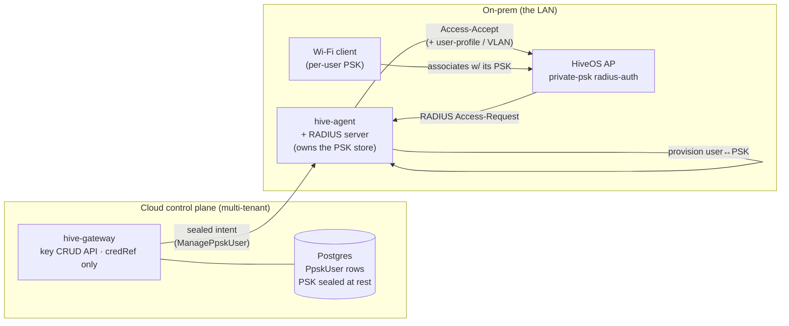

> **Status: BUILT and unit-tested; lab-untested (milestone 4 pending).** This is the architecture for PPSK
> *Caminho B* (admin-driven key minting). *Caminho A* (self-registration) and the AP→RADIUS wiring already ship
> live-confirmed; milestones 1-3 below (the sealed `ManagePpskUser` pipeline, the gateway key CRUD, and the
> agent's FreeRADIUS provisioning) are implemented and unit-tested. The remaining work is the **live lab
> validation** (milestone 4) — see the [runbook](ppsk-radius-runbook.md) — which also captures the one open
> grammar question (the Aerohive user-profile VSA). The CLI grammar quoted here was confirmed live on an AP230
> (HiveOS 10.6r1a).

## The gap

Today HiveKeeper can *enable* PPSK on an SSID (Caminho A) but it **cannot mint an individual user's key**. That
is a deliberate, confirmed limitation, not an oversight:

- HiveOS exposes **no running-config grammar to create a per-user key over SSH** — `security-object <so>
  security private-psk user …` is rejected on the AP230 (confirmed live). Key creation is HiveManager's
  proprietary channel.
- The AP's local PPSK users live in a separate **TPM-backed store** (`users.txt`), **not** in the replayable
  running-config, so writing keys there over SSH is neither supported nor safe.

So an operator who wants HiveKeeper to *own* the key lifecycle (generate / rotate / revoke a named user's PSK,
with a VLAN / user-profile and a validity schedule) needs a path that does not depend on AP-side key grammar.

## Approach: the on-prem agent runs RADIUS

The clean, north-star-aligned design is to make the **on-prem `hive-agent` run (or own) a RADIUS server** that
holds the user↔PSK mappings, and point the AP at it. HiveKeeper owns a **key CRUD** in its database and
**provisions the RADIUS store**; the AP authenticates private-PSK users against that RADIUS over the LAN.



### Why this fits the north star

- **Secrets never leave the LAN as usable plaintext.** The PSK is generated and stored on-prem (the agent's
  RADIUS store / vault, encrypted at rest); the cloud gateway holds only a **reference** (`credRef`-style id) and
  metadata, never a usable key — exactly the sealed-credential model already used for SSH credentials
  (`EnvelopeCipher`, `env1:` tokens). See [Architecture](/architecture/).
- **`hive-core` stays tenant-unaware and transport-agnostic.** Key management rides the existing
  `Command` / `Result` pipeline, so it works identically from CLI, server, and the agent/gateway.
- **No new AP-side grammar dependency.** The AP only needs the standard `radius-auth` wiring below, which is
  already in HiveOS.

## What is confirmed live vs. what must be built

### Confirmed live on the AP230 (the AP→RADIUS wiring)

```text
aaa ppsk-server radius-server primary <radius-ip> [shared-secret <secret>]   # + backup1..3, auto-save-interval
security-object <so> security private-psk radius-auth <method>               # forward PPSK auth to RADIUS
security-object <so> security private-psk external-server                    # look up PSKs on an external server
```

(`aaa ppsk-server radius-server ?` offers `primary`/`backup1..3`; `security-object <so> security private-psk ?`
offers `radius-auth`, `external-server`, `both`, `mac-binding-*`, `same-user-limit`, `self-reg-enable`,
`default-psk-disabled` — all confirmed live.) These become a `ppskRadiusCommands(...)` builder, dispatched
through the existing `apply-config` path (a tested guided form, like the Phase-2 RADIUS suites).

### Must be built (the subsystem)

1. **A RADIUS runtime owned by the agent.** Either embed a minimal RADIUS responder in `hive-agent` or have the
   agent manage a co-located **FreeRADIUS** (the safer, battle-tested choice). It must answer the AP's
   private-PSK Access-Requests and return the matching user's PSK plus its **user-profile / VLAN** (the Aerohive
   vendor-specific attributes — the exact dictionary must be validated against the AP, see Open questions).
2. **A key store** (user↔PSK) owned on-prem, encrypted at rest, provisioned by HiveKeeper.
3. **Key CRUD** in HiveKeeper: generate / rotate / revoke a named user's PSK, scoped to a security-object /
   user-group, with optional VLAN and a validity `schedule` (the [schedule objects](/capabilities/) already
   ship).

## Data model

A `PpskUser` row (cloud DB, tenant-scoped under Postgres RLS):

| field | notes |
|---|---|
| `id` | stable key id |
| `tenantId`, `agentId` | which on-prem RADIUS owns it |
| `securityObject` / `userGroup` | the SSID security-object + PPSK user-group it belongs to |
| `username` | the registrant identity |
| `pskRef` | **reference only** — the usable PSK lives on-prem; the cloud never stores plaintext |
| `userProfileAttr`, `vlanId` | the policy RADIUS returns on Accept (ties into Phase-3 user-profiles) |
| `scheduleName` | optional validity window (Phase-5 schedule object) |
| `macBindings` | optional bound MACs (`private-psk mac-binding-*`) |
| `status` | active / revoked |
| `createdAt`, `rotatedAt` | lifecycle timestamps |

## Pipeline additions

- **Command** `ManagePpskUser { action: create|rotate|revoke, securityObject, username, userProfileAttr?,
  vlanId?, scheduleName?, sealedPsk? }` and **Result** `PpskUserManaged { username, pskRef, status }`.
- The gateway **generates the PSK** (or the agent does — see Open questions), **seals** it to the agent's public
  key (`EnvelopeCipher`), and dispatches the command; the agent unseals on-prem and writes it into the RADIUS
  store. The cloud persists only `pskRef` + metadata. Durable jobs encrypt the command at rest exactly as the
  SSID-passphrase / shared-secret jobs do today (`Secrets`, `gcm1:`).

## Key generation

A strong PSK: 8–63 ASCII chars (WPA2/3 passphrase range), drawn from `crypto.getRandomValues`, default ~20 chars
from an unambiguous charset (no `0/O`, `1/l/I`). Pure + RNG-injectable so it is unit-testable. Optional
human-readable "word-group" PSKs as a later nicety.

## Gateway API & authorization

REST under the existing `GatewayController`, mirroring the agent-op authz model
([Architecture](/architecture/)):

- `POST /api/agents/{id}/ppsk-users` (create), `POST …/{username}/rotate`, `DELETE …/{username}` (revoke).
- `GET /api/agents/{id}/ppsk-users` (list — metadata only, never the PSK).
- Role **OPERATOR** on the agent's site for create/rotate/revoke; **VIEWER** to list. Tenant-scoped; the
  response is `Secrets`-redacted and never carries a usable key.

## Validation / rollout plan (lab)

1. Stand up FreeRADIUS co-located with the agent (a container on the agent host — the dev box uses Podman).
2. Point a **throwaway** security-object at it: `aaa ppsk-server radius-server primary <agent-ip> shared-secret
   …` + `security-object HKB security private-psk radius-auth …` (apply + revert, non-persistent — the
   confirm-gated pattern used throughout).
3. Provision one `PpskUser`, connect a client with its PSK, confirm Access-Accept + the returned VLAN, then
   rotate and revoke and confirm the client is re-keyed / dropped.
4. Only after this end-to-end pass does the feature leave "untested" — the same bar every other live-confirmed
   feature met.

> **Risk discipline:** PPSK-via-RADIUS changes an SSID's authentication path. Validate on a **test
> security-object / SSID**, never the production one, so a misconfig cannot lock out live clients. This mirrors
> the firmware-upgrade caution — auth changes are reversible but disruptive.

## Open questions

- **Embedded responder vs. managed FreeRADIUS.** FreeRADIUS is safer and standard but adds a process the agent
  must lifecycle; a minimal embedded responder keeps the agent self-contained but must implement exactly the
  Aerohive PPSK attribute exchange. Lean FreeRADIUS unless the embedded path proves simple.
- **Exact Aerohive RADIUS attributes** for returning a PPSK + user-profile/VLAN on Accept — must be captured
  from a real exchange (the AP230) before the responder is trusted.
- **Where the PSK is generated** — gateway (then sealed to the agent) keeps generation auditable centrally;
  agent-side keeps the plaintext from ever existing in the cloud even transiently. The sealed model supports
  either; agent-side generation is the stricter, preferred default.
- **MAC binding & same-user limits** (`private-psk mac-binding-*`, `same-user-limit`) — expose in the CRUD or
  defer.

## Milestones

1. AP→RADIUS wiring builder (`ppskRadiusCommands`) + guided form — **SHIPPED**. A `ppskRadiusCommands` builder and
   a **PPSK via RADIUS** block in the Wi-Fi section emit `aaa ppsk-server radius-server primary <ip> [shared-secret
   <s>] [auth-port <n>]`, `aaa ppsk-server auto-save-interval <60-3600>`, and `[no] security-object <so> security
   private-psk radius-auth [pap|chap|ms-chap-v2]` via apply-config. The `radius-auth <method>` placeholder is now
   resolved: `?`-help on the AP230 offers **pap** (default), **chap**, **ms-chap-v2**, and a bare `radius-auth`
   enables it with PAP. All lines were applied to the running-config, confirmed, and reverted live on the AP230
   (non-persistent). The shared secret is masked by `Secrets` server-side. Unit-tested.
2. `PpskUser` model + key CRUD API + sealed `ManagePpskUser` pipeline — **SHIPPED (unit-tested)**. The
   `ManagePpskUser` command / `PpskUserManaged` result ride the agent-control path (handled before SSH dispatch,
   like `SetCredential` — the AP is never touched). The gateway generates the PSK (`PskGenerator`), seals it to
   the agent (`EnvelopeCipher`), persists **metadata + `psk_ref` only** (`ppsk_user`, Flyway `V9`, RLS;
   `PostgresPpskUserService` / `InMemoryPpskUserService`), and exposes the REST + authz above (returning the key
   once). The agent unseals locally and writes the encrypted-at-rest `FilePpskUserStore`. A **PPSK users** web
   tab drives the CRUD. **Where the PSK is generated** (open question) resolved to **gateway-side**, sealed to
   the agent — consistent with the existing `SetCredential` flow; the cloud never persists the usable key.
3. Agent RADIUS runtime (FreeRADIUS integration) + provisioning — **SHIPPED (unit-tested)**.
   `FreeRadiusFilesProvisioner` renders the user set into a FreeRADIUS `files` authorize file (PAP
   `Cleartext-Password` + RFC 2868 VLAN tunnel attributes) on every mutation; `scripts/dev-radius.ps1` runs
   FreeRADIUS in Podman co-located with the agent. **Embedded vs. managed FreeRADIUS** (open question) resolved
   to **managed FreeRADIUS** reading an agent-written authorize file (the Java side stays pure + testable).
4. Live lab validation (the plan above) → leave "untested" — **REMAINS**. See the dedicated
   [runbook](ppsk-radius-runbook.md). The one unresolved open question is the **exact Aerohive user-profile VSA**
   for returning a named user-profile on Accept: the RFC VLAN attributes are emitted; the VSA is a documented
   comment until captured from a real exchange.
